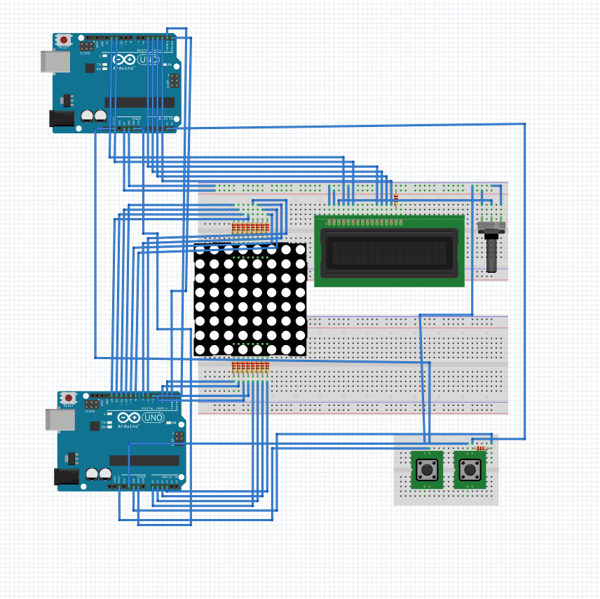

# ArduinoFinalProject
105-1 Arduino

# About this project
Game name : Arduino Jump
 - A DAMN good Game made with arduino.
 - Extremely hard.
 - LCD display will show your score.

# How to play
1. Press left button to reset the game.
2. Press right button to start.
3. Enjoy!

# Components
1. Arduino UNO (with power cable) x2
2. Breadboard x3
3. 8x8 LED matrix x1
4. 16x2 LCD display x1
5. Potentiometer x1
6. Buzzer x1
7. Momentary button x2
8. Hook-up wire x38
9. 10K resister x10
10. Enthusiasm and Curiosity

# Circuit diagram

